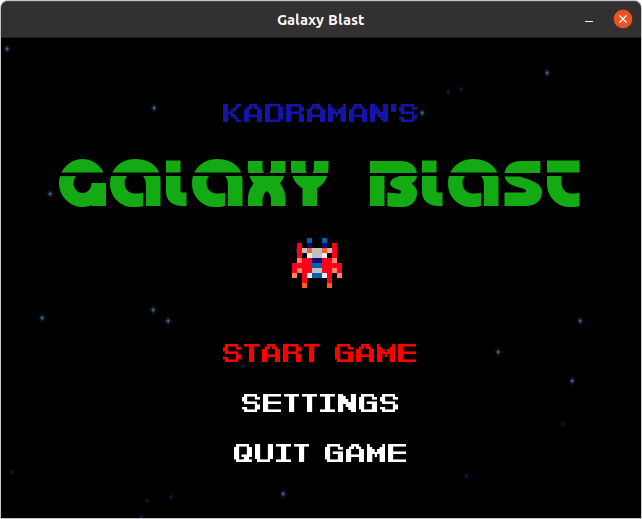
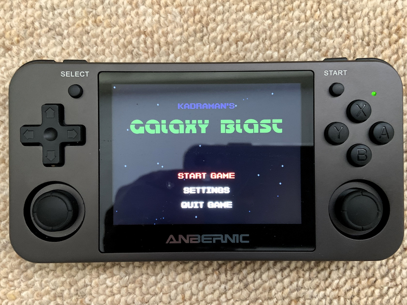
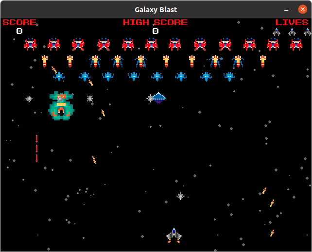

This is a simple but functional retro space shooter written in [Python](https://www.python.org/)
using the [Pygame](https://www.pygame.org/) library. It makes use of some interesting practices 
that you could potentially use in your own game, including:

    - State machine for navigating between games states and passing/persisting data between them
    - Use of "spritesheets" to quickly load sprite data from a single file
    - Simple menu system for selecting/navigating the game
    - Game control using keyboard or joystick/gamepad
    - Frame independence using "delta time" in animations

The game's graphics are bespoke (with [Galaga](https://en.wikipedia.org/wiki/Galaga) style enemies) but 
sounds and music are download from [Freesound](https://freesound.org/).
The individual files have retained original filenames with id and user for reference and attribution.

## Running the game

The game should work with Python 2 and 3, please make sure Pygame is installed:

```aidl
pip install pygame
```

and then run the game using:

```aidl
python main.py
```

As a "bonus" there is also a `build.sh` script that I used to "compile" the project and
install it onto a handheld [Anbernic RG350M](https://anbernic.com/products/rg351m-anbernic-retro-game-rg350m-video-games-game-console-ps1-game-64bit-opendingux-3-5-inch-2500-games-rg351-emulator)
retro console (since this runs [Opendingux](https://opendingux.net/) with an old version of Python!)



## Playing the game

The game play should be recognisable - simply kill as many enemies as possible (as many times as 
possible) before you loose all of your lives! There are a number of enemies which move and attack in
different ways and are worth different points:

 - 1 point 
 - 2 points
 - 5 points
 - 10 points (watch those mines)
 - 25 points (takes a few hits)

There's also an extra 50 points for completing a wave!



Enjoy!!

"kadraman"
